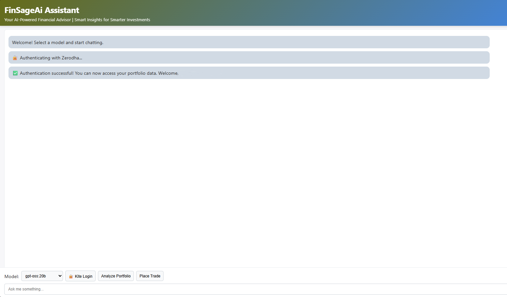

# FinSageAi Assistant

<div align="center">

**AI-Powered Trading Assistant for Zerodha Kite**

*Chat with local LLMs, analyze your portfolio, and execute trades—all from one interface*

[](LICENSE)
[](https://nodejs.org/)
[](https://ollama.ai/)

[Installation](#-quick-start)  [Features](#-features)  [Documentation](#-documentation)  [Contributing](#-contributing)

</div>


## 🎯 Overview

FinSageAi Assistant combines the power of local large language models (via Ollama) with real-time trading capabilities through Zerodha's Kite Connect API. Get AI-powered portfolio analysis, market insights, and seamless trade execution—all while keeping your data local and secure.

### Why FinSageAi?

- 🔒 **Fully Local:** No data sent to external AI services—your portfolio stays private
- 🧠 **Smart Analysis:** AI-powered portfolio insights, sector analysis, and risk assessment
- 📊 **Visual Charts:** Auto-generated portfolio allocation and performance charts
- 🛡️ **Safe Trading:** Human-in-the-loop confirmation for all trades
- ⚡ **Easy Setup:** Get running in under 10 minutes

---

## ✨ Features

### 💬 AI Chat Interface
- Select from multiple Ollama models (llama3.1:8b, qwen2.5:14b, gpt-oss:20b)
- Natural language queries about your portfolio
- Context-aware financial advice

### 📊 Portfolio Analysis
- **Real-time data** from your Zerodha account
- **Automated insights:**
  - Sector allocation and diversification
  - Top performers and underperformers
  - Risk assessment and concentration analysis
  - Actionable buy/sell/hold recommendations
- **Visual dashboards:**
  - Portfolio allocation pie charts
  - P&L bar charts by stock
  - Sector distribution doughnut charts

### 📈 Trade Execution
- Natural language order placement: *"Buy 10 shares of INFY at market price"*
- AI extracts order details into structured format
- **Safety first:** Manual confirmation required before execution
- Support for market and limit orders
- CNC, MIS, and NRML product types

### 🔐 Authentication
- Secure OAuth2 flow with Zerodha
- Daily token refresh handling
- Session management

---

## Screenshots

### Landing Page


### Portfolio Analysis Examples

**Comprehensive Portfolio Overview**


**Sector Allocation & Risk Assessment**


**Top Performers & Recommendations**


**Detailed Stock Analysis with Charts**


---

## ⚡ Quick Start

### Prerequisites
- **Node.js v18+** ([Download](https://nodejs.org/))
- **Ollama** ([Download](https://ollama.ai/))
- **Zerodha Trading Account** with [Kite Connect API](https://developers.kite.trade/) (₹2,000/month)

### Installation (5 minutes)

```bash
# 1. Clone the repository
git clone https://github.com/YOUR_USERNAME/FinSageAi-Assistant.git
cd FinSageAi-Assistant

# 2. Install dependencies
npm install

# 3. Configure environment
cp .env.example .env
# Edit .env with your Kite API credentials

# 4. Verify setup
node verify-setup.js

# 5. Start Ollama (separate terminal)
ollama serve

# 6. Pull an AI model
ollama pull llama3.1:8b

# 7. Start the application
npm start
```

### First Use
1. Open http://localhost:15600 in your browser
2. Click **🔐 Kite Login** to authenticate with Zerodha
3. Select an Ollama model from the dropdown
4. Click **📊 Analyze Portfolio** to see your AI-powered analysis

**📚 Detailed setup instructions:** See [INSTALLATION.md](INSTALLATION.md)

---

## 💡 Usage Examples

### Example 1: Portfolio Analysis
```
You: Analyze my portfolio

AI: Fetching your portfolio data...
    
    📊 Portfolio Summary:
    - Total Value: ₹4,85,234
    - Total P&L: +₹45,123 (10.2%)
    - Holdings: 12 stocks
    
    💡 Top Performers:
    1. INFY: +25.3%
    2. TCS: +18.7%
    
    ⚠️ Underperformers:
    1. HDFC: -8.2%
    
    💰 Recommendations:
    - Consider reducing IT sector exposure (45%)
    - Diversify into FMCG and Pharma
    - Book partial profits in INFY
    
    [Auto-generated charts displayed]
```

### Example 2: Trade Execution
```
You: Sell 5 shares of ITCHOTELS at market price

AI: Preparing your order...

    ```order
    {
      "tradingsymbol": "ITCHOTELS",
      "exchange": "NSE",
      "transaction_type": "SELL",
      "quantity": 5,
      "order_type": "MARKET",
      "product": "CNC"
    }
    ```
    
    📋 Order Ready for Confirmation:
    - Stock: ITCHOTELS
    - Type: SELL
    - Quantity: 5 shares
    - Order Type: MARKET
    
    ⚠️ Type "CONFIRM" to execute or "CANCEL" to abort.

You: CONFIRM

AI: ✅ Order Placed Successfully!
    Order ID: 240123000123456
```

---

## 📚 Documentation

| Document | Description |
|----------|-------------|
| [INSTALLATION.md](INSTALLATION.md) | Complete setup guide with troubleshooting |
| [KITE_AUTH_GUIDE.md](KITE_AUTH_GUIDE.md) | Zerodha authentication flow details |
| [SETUP_ZERODHA_DATA.md](SETUP_ZERODHA_DATA.md) | Connecting real portfolio data |
| [CHARTS_GUIDE.md](CHARTS_GUIDE.md) | Custom chart generation |
| [DOCKER_DEPLOYMENT.md](DOCKER_DEPLOYMENT.md) | Docker/containerized deployment |
| [CONTRIBUTING.md](CONTRIBUTING.md) | How to contribute to the project |

---

## 🏗️ Architecture

```
┌─────────────┐      ┌──────────────┐        ┌─────────────┐
│   Browser   │──────▶│  Express API│──────▶│   Ollama    │
│   (Port UI) │      │  (Port 15600)│        │  (Port 11434│
└─────────────┘      └──────────────┘        └─────────────┘
                            │
                            ├──────▶ Kite Connect API
                            │       (api.kite.trade)
                            │
                            └──────▶ MCP Remote (optional)
                                    (mcp.kite.trade)
```

**Key Components:**
- `server.js` - Express API server & Ollama bridge
- `kiteClient.js` - Direct Kite Connect API calls
- `mcpClient.js` - Model Context Protocol client
- `public/` - Frontend (HTML/CSS/JS)

---

## 🔌 API Endpoints

| Endpoint | Method | Description |
|----------|--------|-------------|
| `/api/llm` | POST | Chat with Ollama models |
| `/api/mcp` | POST | Execute Kite API actions |
| `/api/health` | GET | System health check |
| `/api/kite/login` | GET | Generate Kite OAuth URL |
| `/api/kite/token` | POST | Exchange request token for access token |
| `/api/mcp/tools` | GET | List available MCP tools |

## Notes
- Frontend is served from Express on port 15600 (same origin, no CORS issues).
- The Ollama call is streamed and concatenated server-side; the client receives final text.
- If your MCP server uses different routes or auth, adjust `callMCP` in `server.js` and the front-end calls in `script.js`.

## Using Remote Kite MCP Server
This project can call Zerodha tools using the Model Context Protocol via `mcp-remote`.

Set environment variables before starting the API:
```powershell
$env:MCP_REMOTE='1'
$env:KITE_MCP_URL='https://mcp.kite.trade/mcp'
# Optional override of command/args if needed:
# $env:MCP_COMMAND='npx'
# $env:MCP_ARGS='["mcp-remote","https://mcp.kite.trade/mcp"]'
npm start
```

When `MCP_REMOTE` is enabled:
- `/api/mcp` treats the `action` field as an MCP tool name.
- Returns raw tool invocation result under `reply`.

Fallback behavior:
- If `MCP_REMOTE` is not set, the server will POST to `http://localhost:5000/{action}` expecting a local adapter.

Front-end mapping suggestions:
- Portfolio summary: use action/tool `portfolio_summary`
- Place order: use action/tool `place_order` with `{ symbol, quantity }`

### Debugging MCP
- Missing tool error: Ensure the tool name matches one exposed by the remote server.
- Connection issues: Verify `npx mcp-remote https://mcp.kite.trade/mcp` works standalone.
- To inspect tools programmatically, extend `mcpClient.js` to log `client.listTools()` on startup.

## Troubleshooting
- Ensure Ollama is running and the selected model is available: `ollama list`.
- Ensure MCP server is running on port 5000, or update the URL in `server.js`.
- If `node-fetch` ESM warnings appear, this project uses ESM via `"type": "module"`.


